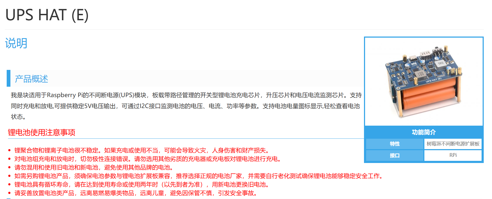
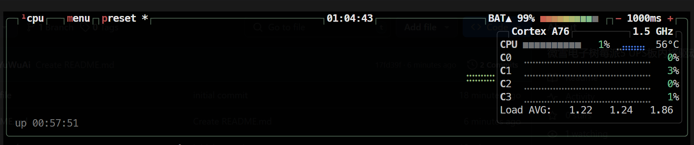

# 微雪树莓派5 UPS 内核驱动
> There is no warranty for this software. Use at your own risk.

> 本软件不提供任何保证，使用风险自负。

## 简介

本项目是一个用于树莓派5的UPS内核驱动，支持通过I2C接口与微雪的UPS模块进行通信。该驱动基于
[微雪官方示例程序](https://www.waveshare.net/wiki/UPS_HAT_(E))开发，使用Linux内核的`I2C Subsystem`和`Power Supply Subsystem`进行实现。该驱动支持对UPS模块的双向升降压检测、充电状态监测等功能。

## 适用范围
已在安装了Ubuntu 24.04.2 LTS系统的树莓派5上测试通过，其他版本的树莓派系统可能需要自行修改设备树代码。

大体思路就是将`rpi-ups`的设备树节点添加到`i2c1`的设备树节点下，然后利用`dkms`系统自动编译内核模块。
## 安装步骤
1. 下载驱动代码
```bash
git clone https://github.com/ChenYuWuAi/waveshare-pi5-ups-e.git
cd waveshare-pi5-ups-e
```
2. 安装依赖
```bash
sudo apt install dkms linux-headers-$(uname -r)
```
3. 安装驱动
```bash
sudo dkms add .
sudo dkms build rpi-ups/1.0
sudo dkms install rpi-ups/1.0
```
4. 检查驱动是否安装成功
```bash
lsmod | grep rpi_ups
```
如果输出类似如下信息，则表示驱动安装成功：
```
rpi_ups               16384  0
```
5. 检查UPS模块是否正常工作
```bash
cat /sys/class/power_supply/rpi-ups-battery/uevent
```
如果输出类似如下信息，则表示UPS模块正常工作：
```
POWER_SUPPLY_NAME=rpi-ups-battery
POWER_SUPPLY_TYPE=UPS
POWER_SUPPLY_STATUS=Charging
POWER_SUPPLY_PRESENT=1
POWER_SUPPLY_VOLTAGE_NOW=16723000
POWER_SUPPLY_CURRENT_NOW=397000
POWER_SUPPLY_POWER_NOW=6639031
POWER_SUPPLY_CAPACITY=100
POWER_SUPPLY_ENERGY_NOW=70418400
POWER_SUPPLY_ENERGY_FULL=72000000
POWER_SUPPLY_MODEL_NAME=RPI-UPS
POWER_SUPPLY_MANUFACTURER=Waveshare
POWER_SUPPLY_TIME_TO_EMPTY_NOW=0
POWER_SUPPLY_TIME_TO_FULL_NOW=8
POWER_SUPPLY_CAPACITY_ALERT_MIN=5
```

btop显示效果：

## 卸载
如果需要卸载驱动，可以使用以下命令：
```bash
sudo dkms remove rpi-ups/1.0
```
## 注意事项
- 请确保树莓派5的I2C接口已启用，并且UPS模块已正确连接到树莓派5的I2C接口。
